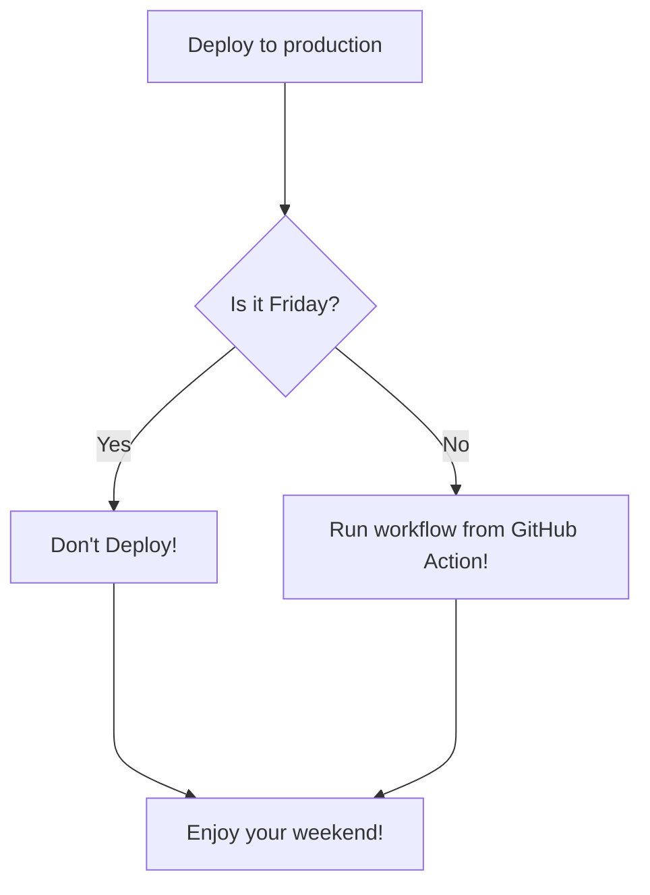

## nodejs-sample

```mermaid
flowchart TD
    A[Deploy to production] ---> B{Is it Friday?};
    B -- Yes --> C[Don't Deploy!];
    B -- No --> D[Run workflow from GitHub Action!];
    C ----> E[Enjoy your weekend!];
    D ----> E[Enjoy your weekend!];
```
